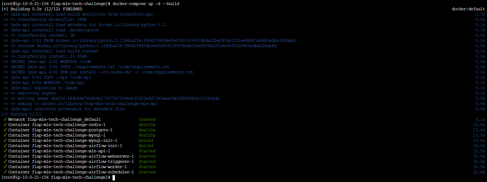

# API EMBRAPA - Vitivinicultura

Esse projeto contém uma API que entrega os dados fornecidos em http://vitibrasil.cnpuv.embrapa.br/

## Recursos
- **FastAPI**: Framework de alta performance utilizado para construção da API.
- **Airflow**: Plataforma de gerenciamento da pipeline de engenharia de dados.
- **MySQL**: Banco de dados utilizado no projeto para armazenar os dados coletados no Scraping.

## Primeiros passos
Para começar nesse projeto, siga as instruções abaixo:

### Pré-requisitos
Esse projeto utiliza o docker compose para orquestração dos containers do projeto. Para você verificar se tem o compose instalado pode rodar o comando:
```bash
docker-compose --version
```

## Instalação
Clone o repositório com:
```bash
git clone git@github.com:dcpadilha/fiap-mle-tech-challenge.git
cd api-vitivinicultura
```

### Iniciar a aplicação: 
Para iniciar o server em modo de desenvolvimento, utilize:
```bash
`source scrapping/scripts/setup_airflow.sh`
```

### Containers criados após a execução do script


### Para a criar os containers manualmente, execute o comando docker-compose abaixo:


Acesse o Airflow em: https://127.0.0.1:8080/home e inicialize as DAGs

Após as DAGs rodarem, as consultas já podem ser feitas na API com o swagger em: https://127.0.0.1/docs

#### No primeiro acesso será necessário criar o usuário admin:
Em um ambiente produtivo, este passo deveria ser feito diretamente no banco.

Para fins instrutivos, criamos um endpoint na API que simplifica esse passo.

Execute o endpoint abaixo com o seguinte Request Body:

```
{
  "usuario": "admin",
  "senha": "admin",
  "role": "ADMIN"
}
```


## Documentação:
- Swagger: https://localhost:8000/docs
- Documentação no padrão [Redoc](https://github.com/Redocly/redoc): https://localhost:8000/redoc

# PLANO DE DEPLOY

## Sobre a solução

A solução é composta de duas grandes partes:

1. Scraping dos dados a partir do site da Embrapa (extração), tratamento dos mesmos (transformação) para salvá-los (carregamento) nas tabelas em um banco de dados do MySQL. Todo este processo é gerenciado pela biblioteca Apache Airflow.
2. Disponibilização dos dados armazenados no banco de dados do MySQL via Rest API usando a biblioteca de Python chamada FastAPI.

### Processo de ETL

O Apache Airflow é uma ferramenta super útil para quem trabalha com automação de tarefas e fluxos de trabalho. Imagina que você precisa executar várias tarefas em uma certa ordem e em certos horários, tipo um cronograma. O Airflow te ajuda a fazer isso de uma maneira organizada e fácil de gerenciar.

No Airflow, é possível criar processos de ETL (*tradução livre: extração, transformação e armazenamento*) usando algo chamado DAG (*tradução livre: grafo direcionado acíclico*). Para criar uma DAG no Airflow, basta basicamente escrever um script em Python onde as tarefas são definidas e a ordem em que elas devem ser executadas. Cada tarefa é um passo no processo de ETL. Na nossa solução, por exemplo, fizemos:

- Extract: Pegamos os dados do site da Embrapa via Web Scraping.
- Transform: Limpamos e formatamos esses dados.
- Load: Salvamos os dados limpos em um banco de dados.

Algumas das vantagens de usar uma ferramenta como o Apache Airflow são:

- Visualização: Ele tem uma interface web intuitiva onde se pode ver todas as DAGs, o status das tarefas, logs, etc. Fica bem fácil de entender o que está acontecendo.
- Agendamento: É possível configurar as DAGs para rodarem em horários específicos - *nós agendamos, por exemplo, para rodar o scraping anualmente*.
- Monitoramento: Se alguma coisa der errado, é possível ver os logs e descobrir o que aconteceu. E se uma tarefa falhar, é possível configurar para ela rodar de novo automaticamente.
- Escalabilidade: Se o fluxo de trabalho crescer, o Airflow consegue lidar com essa mudança. Também é possível adicionar mais máquinas para distribuir a carga.
- Flexibilidade: Como ele roda códigos escritos em Python, existem muitas possibilidades a serem exploradas. Se é possível codificar, dá para automatizar com o Airflow.

### Consumo de dados via API

Para a parte da construção da API, utilizamos a biblioteca FastAPI. Ela é uma ferramenta muito utilizada na indústria para construir APIs para diversas aplicações de forma rápida. Uma das facilidades que a biblioteca fornece, além da rapidez e segurança, é a documentação gerada automaticamente das APIs RESTful. Outro ponto que vale a pena destacar é a validação de dados feita pela biblioteca Pydantic, que garante que os tipos/formatdos dos dados sigam o que foi determinado no backend.

#### Endpoints

##### Airflow DAGs

- \[GET\] `/airflow/dags`: Retorna quais são as DAGs disponíveis no Apache Airflow.
- \[POST\] `/airflow/dags/reprocess`: Endpoint que permite a execução manual de **todas** as DAGs (*atualização manual dos dados obtidos via web scraping do site da Embrapa*).

> *Nível de autorização necessário para utilizar os endpoints do Airflow é de administrador!*

##### Autenticação

- \[POST\] `/token`: Cria token de acesso para usuários que possuem autorização.

##### Consulta de dados


- \[GET\] `/vitibrasil`: Retorna todos os dados disponíveis no banco de dados.
- \[GET\] `/vitibrasil/{id}`: Retorna o resultado da consulta por id.
- \[GET\] `/vitibrasil/categoria`: Retorna os dados divididos por categoria do produto.
- \[GET\] `/vitibrasil/origem`: Retorna os dados divididos pela origem do produto.

### Conectando os componentes

Para conciliar os códigos de ETL e de disponibilização dos dados via API, tivemos que juntá-los, cada um com a sua responsabilidade, e dar um jeito de fazê-los comunicarem entre si, tornando-os compatíveis: aqui entra o Docker Compose. 

> O Docker Compose é o responsável por orquestrar todas as partes, ou "blocos", com o código da solução que estão "containerizadas".

#### Componentes do Docker

##### Imagens

1. Processo de ETL

- postgres
- redis
- airflow-webserver
- airflow-scheduler
- airflow-worker
- airflow-triggerer
- airflow-init
- airflow-cli
- flower

2. API

- mle-api
- mysql

##### Volumes

1. Processo de ETL

- postgres-db-volume
- /opt/airflow/dags
- /opt/airflow/logs
- /opt/airflow/plugins
- /sources

2. API

- mysql-data

## Fluxo para Deploy

1. Criamos um repo no GitHub para a escrita dos códigos que compõem a aplicação;
2. Através do Docker Compose, escrevemos um `docker-compose.yaml` que detalha quais são as imagens, os volumes e a infraestrutura de rede interna que possibilita a comunicação entre as imagens;
3. Com o código e as instruções do Docker escritos, utilizamos o serviço da Amazon Web Services (AWS) para hospedar a nossa solução através do serviço Amazon Elastic Compute Cloud (Amazon EC2).
4. O consumo dos dados obtidos é feito via consultas nos endpoints apropriados
5. A atualização dos dados e a supervisão sobre o status dos processos é feita via Apache Airflow de duas maneiras:
	1. Automaticamente através dos *schedules*
	2. Manualmente via endpoint reservado para os administradores

## Arquitetura da Solução

 A figura abaixo contém um esquema ilustrativo dos principais pontos e conceitos da solução criada.


## Diagrama da infraestrutura:

Para fins ilustrativos, este projeto foi publicado utilizando recursos da AWS conforme o diagrama abaixo.

De modo a proteger o ambiente, a instância EC2 foi criada em uma subnet privada e um balanceador de carga foi posicionado de forma a permitir o acesso à aplicação de forma pública.

Note, porém, que não é necessário dispor de uma infraestrutura AWS para reproduzir o ambiente.

Ao seguir os passos descritos na seção de instalação acima em qualquer computador será possível fazer a implantação dos serviços.

### Requisitos mínimos

Para nossa simulação foi provisionada uma instânica EC2 do tipo t2.large (2 vCPUs / 8GB RAM) com 50GB de espaço em disco.


## License
